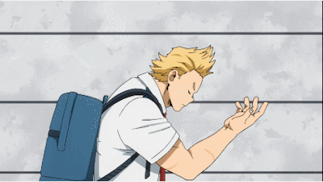
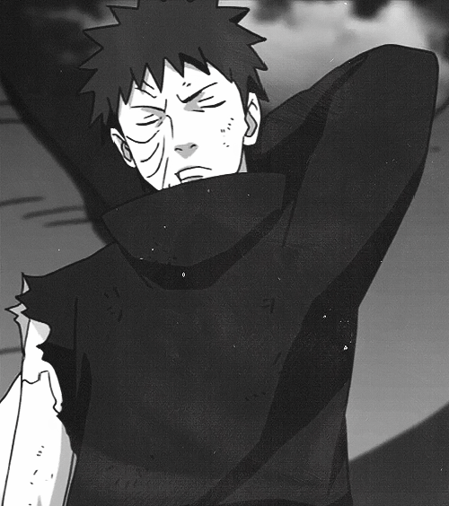
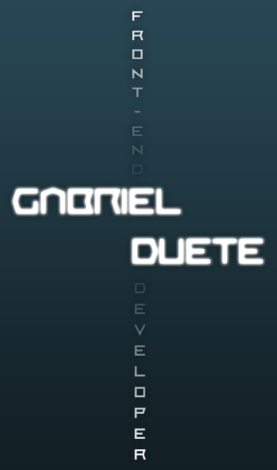
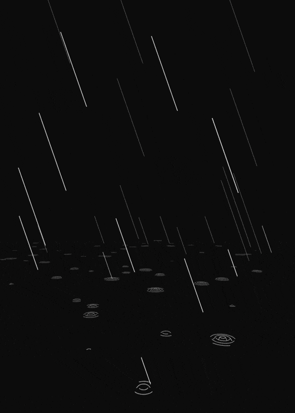

<table>
  <tr>
    <td valign="top"> </td>
    <td valign="top" width = '400px'></td>
    <td valign="top">  </td>
  </tr>
</table>

<h1 align = 'center' > Bem vindo(a)! </h1>
<h3 align= 'center' ><em>
    Me chamo Gabriel Duete, tenho 21 anos e sou desenvolvedor frontend na Juntos Somos Mais 💙. Atualmente cursando S.I pelo IFCE. Empolgado para aprender e ensinar outras pessoas, para que de alguma forma possa contribuir com a comunidade Tech. Sempre em constante estudo para ampliar meu conhecimento ou aprender novas tecnologias. Sou bastante fácil de lidar por estar sempre ouvindo o próximo.</em>
</h3>

 

<h1 align = 'center' > Habilidades </h1>
<h3>👩‍💻 Linguagens</h3> 

    
    

 

<h3>🚀 Frameworks & Bibliotecas</h3>

- <h4>👀 Javascript</h4>

    
    

- <h4>🎨 Estilos</h4>

    
    

 

<h3>👩‍💻 Linguagens de Marcação</h3> 

    
    

 

<h3>🧐 Linters</h3>

    
    

 

<h3>📚 Vistos nas disciplinas da faculdade: </h3>

    
    
     

 

<h1 align = 'center' > Status </h1>

    
        

 

<h1 align = 'center' > Hobbies </h1>

💪 Musculação: Pratico e estudava musculação, no momento parado a mais de dois anos por conta da pandemia.

🎮 Games: Gosto de jogar desde pequeno quando ganhei meu primeiro PS2. Meu jogo favorito de todos é o League of Legends, onde cheguei a pegar mestre lá.

🧧 Animes: Curto bastante animes, eles me dão emoções incríveis! Séries e filmes de hérois também são bem-vindos.

📕 HQ's e Livros: Gosto de ler HQ's da Marvel e DC, principalmente as do Venom e Flash. Estou lendo todos os livros de Assassin's Creed e também alguns de algoritmos.

 

<h1 align = 'center' > Fala Comigo! </h1>
  
    
  
    
   
  
 
<blockquote> 
    Espero que você tenha gostado de me conhecer. Até mais! 👋 
</<blockquote> 
 
